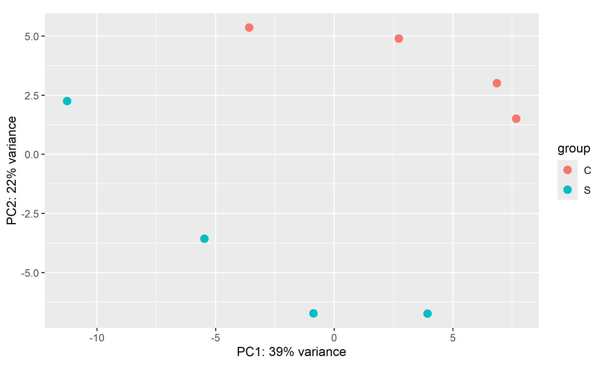
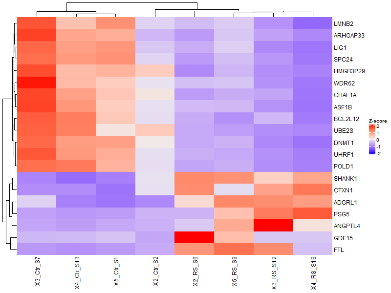
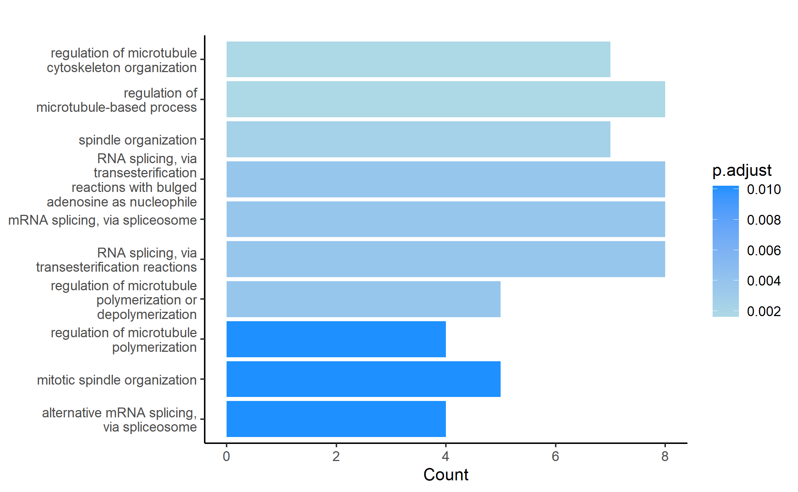
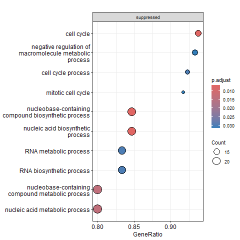

# RNA-Seq Practice Example

This repository contains an example RNA-seq analysis pipeline for practice purposes.

## Dataset
- Species: **Human**
- Samples: **4 treatment vs 4 control**
- Only **chromosome 19** is mapped
- Input: **Gene-by-sample count matrix**

## Downstream Analyses
1. **Differential Expression Analysis**  
   Identify genes that are up- or down-regulated between treatment and control.

2. **Pathway/Functional Enrichment Analysis**  
   Explore enriched pathways or biological functions based on the differentially expressed genes.

## Data Source
The RNA-seq data analyzed in this repository was obtained from: 
Matthews C, Gorenne I, Scott S, et al. Vascular smooth muscle cells undergo telomere-based senescence in human atherosclerosis: effects of telomerase and oxidative stress. Circ Res. 2006;99(2):156-164. doi:10.1161/01.RES.0000233315.38086.bc

GEO Accession number: GSE171663

## Visualizations

  
  

  
  

  

